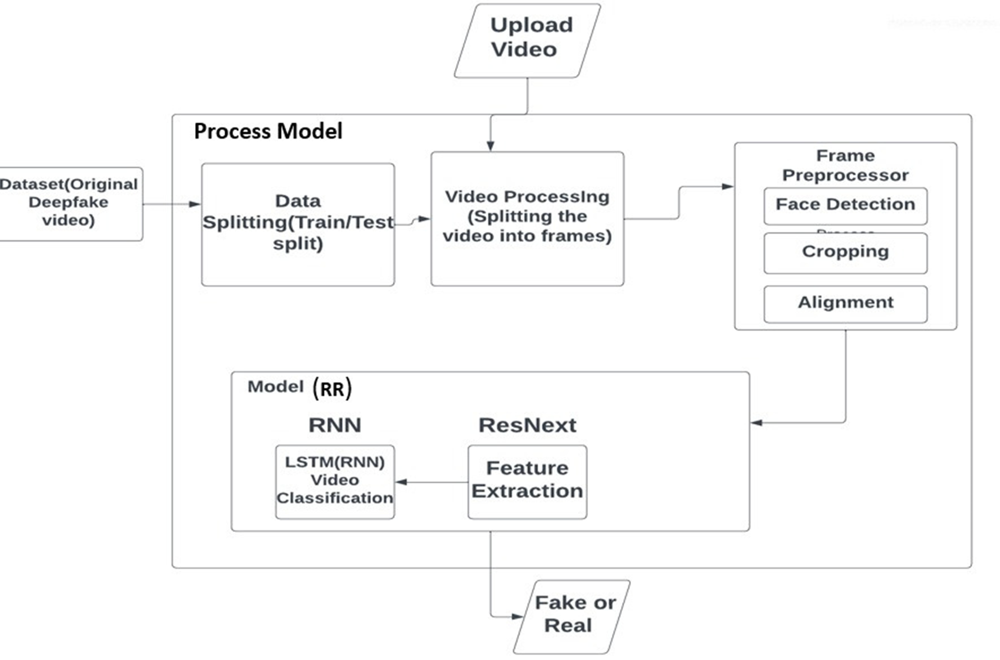

# DeepFake Detection Platform

A full-stack platform for detecting DeepFake videos using deep learning. This project combines a PyTorch-based backend for video analysis and a React-based frontend for user interaction.

---

## 🏗️ Project Architecture



---

## 🚀 Features
- **End-to-end DeepFake detection**: Upload a video and get a real/fake prediction with confidence.
- **Preprocessing pipeline**: Extracts frame-level features using ResNeXt50.
- **Temporal modeling**: LSTM classifier learns temporal patterns in video frames.
- **Modern UI**: React frontend for easy video upload and result visualization.

---

## 📂 Dataset
- **Celeb-DF v2**: Used for training and evaluation.
- Place videos in `data/Celeb-real/` (real) and `data/Celeb-synthesis/` (fake).

---

## 🗂️ File & Folder Roles
- `full_pipeline.py`: Complete pipeline for feature extraction, dataset building, LSTM training, and prediction.
- `app.py`: Flask backend serving the prediction API for the frontend.
- `src/`: React frontend source code.
- `src/assets/architecture.png`: System architecture diagram.
- `features/`: Stores extracted features and `index.txt` (created at runtime).
- `models/`: Stores trained LSTM model (`lstm_model.pt`, created at runtime).
- `data/`: Place your dataset here (see above).

---

## ⚙️ Setup Instructions

### 1. Python Backend (Flask + PyTorch)

#### a. Install dependencies
```bash
pip install torch torchvision flask flask-cors numpy pillow opencv-python
```

#### b. Prepare dataset
- Download [Celeb-DF v2](https://github.com/yuezunli/celeb-deepfakeforensics) and organize as:
  - `data/Celeb-real/` (real videos)
  - `data/Celeb-synthesis/` (fake videos)

#### c. Run the pipeline (feature extraction + training)
```bash
python full_pipeline.py
```
- This will extract features, build the dataset, train the LSTM, and save the model to `models/lstm_model.pt`.

#### d. Start the backend server
```bash
python app.py
```
- The Flask server will run at `http://127.0.0.1:5000/`

---

### 2. React Frontend

#### a. Install dependencies
```bash
cd src
npm install
```

#### b. Start the frontend
```bash
npm start
```
- The app will run at `http://localhost:3000/`

---

## 🧪 Usage
1. Open the frontend in your browser.
2. Upload an MP4 video.
3. Click "Predict" to get the result (Real/Fake + confidence score).

---

## 📜 Credits
- **Dataset**: [Celeb-DF v2](https://github.com/yuezunli/celeb-deepfakeforensics)
- **Backbone**: ResNeXt50 (PyTorch)
- **Frontend**: React

---

## 📬 Contact
For questions or contributions, open an issue or pull request on GitHub.
